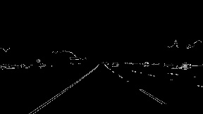
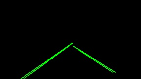
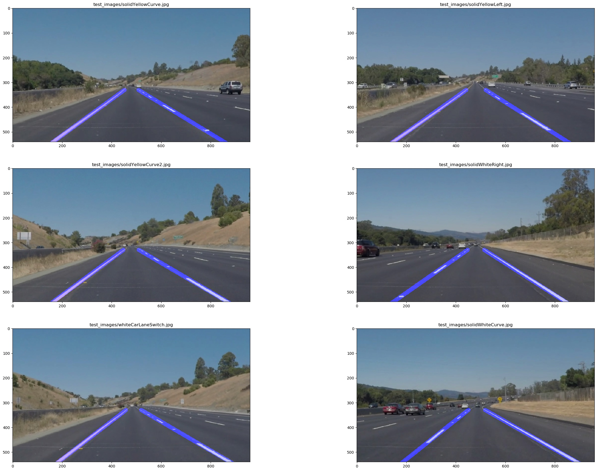

# **Finding Lane Lines on the Road** 


---

**Finding Lane Lines on the Road**

The goals / steps of this project are the following:
* Make a pipeline that finds lane lines on the road
* Reflect on your work in a written report


## Reflection

### 1. Describe your pipeline. As part of the description, explain how you modified the draw_lines() function.

### 1.1 My pipeline consisted of 5 steps. 

1. tansfrom color image to gray scale image then using gaussian blur to smooth the gray image  
   
1. using canny to detect edges  
     
1. set 4 vertices of our interest region and using this region as a mask to rule out the non-related lines.    
   
1. apply hough transform to detect the line segment   
    
1. Draw hough lines on the original image.  
   
 
### 1.2 In order to draw a single line on the left and right lanes, I defined another function to draw the final lane lines called draw_lane_lines() function :

1. For each line in the set of hough line segments, calculate the slope and only keep the line segments whoes absolute value of slope is between 0.4~1(marked as blue and green) and drop those slope outside the threshold(marked as red) 
([figure 2-1]())
2. Divide those lines into two groups, the left group contains the line segments whoes slope is below zero (blue line) and the right group contains the line segments whoes slope is above zero (green line)
([figure 2-1]())
3. Apply linear regression to all the points in each group to get two lines(np.polyfit returns the slope and intercept of each line)
([figure 2-2]())
4. the farest points in the two lines is considering at the top of rio and the closest point is at the bottom of rio
5. Draw the lane lines by using the slope,intercept,bottomY and topY ([figure 2-3]())    

-----
 

 
 
 


### 2. Identify potential shortcomings with your current pipeline

1. the algorithm that I use will fail when there are curved lines inside the region of interest .
2. the parameter of canny and hough transform may not be the best and it can not adjust depending on the different situations
3. the correctness of the result can be influenced by the light condition
4. when I apply the pipeline to the video , the lane lines has jittering


### 3. Suggest possible improvements to your pipeline

- A possible improvement would be to figure out how to detect the curved line
- Another potential improvement could be to try to eliminate  influence of the light condition
- I also want to try to apply low-pass filter to the lane lines to eliminate the jittering


## Result
### 1. apple pipeline to all the test images
```python
test_images/solidYellowCurve.jpg
test_images/solidYellowLeft.jpg
test_images/solidYellowCurve2.jpg
test_images/solidWhiteRight.jpg
test_images/whiteCarLaneSwitch.jpg
test_images/solidWhiteCurve.jpg

def draw_test_images():
    check_images = []
    for img in images :
        _img = mpimg.imread("test_images/"+img)
        check_images.append({"test_images/"+img : _pipeline(_img)})
    draw_imgs(check_images)
    
draw_test_images()
```

### 2. apply pipeline to test vedios
#### Test on solidWhiteRight.mp4

#### Test on solidYellowLeft.mp4

#### Test on challenge.mp4 (fail)
